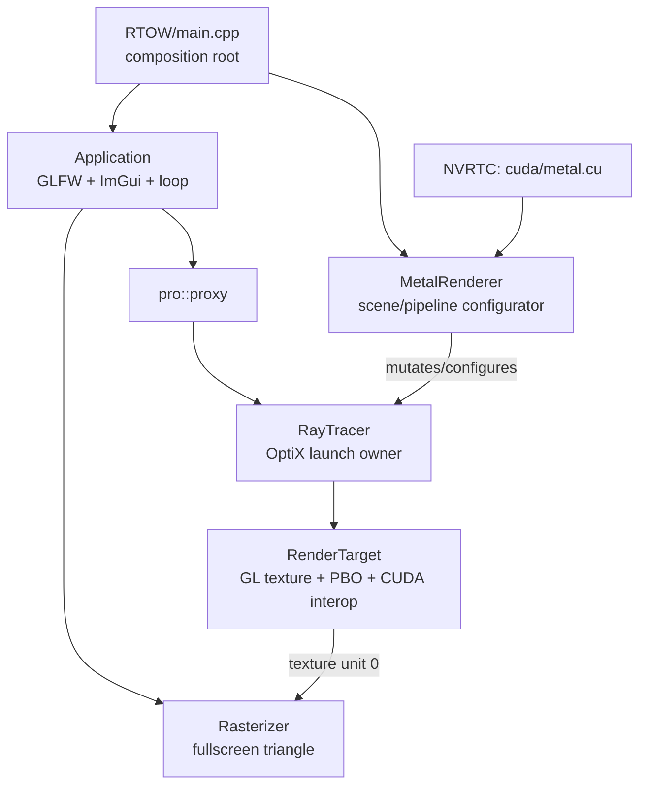

# Venusaur 项目维护指南

> 这是一份面向后续维护者与代码审计者的“事实地图”，不是对当前实现的背书。
> 快照日期：2026-08-13（America/Toronto）；主线：`Reconstruction`；代码基线：`667ed24922c3fdd29ff7ee0289f0eb036ecea281`。
> 当前里程碑、验证结果和唯一下一步见 [`PROJECT_STATUS.md`](PROJECT_STATUS.md)；新对话应先读状态文件，再按需查阅本指南。

## 1. 一页结论

Venusaur 历史上确实完成过一版 OptiX 的 *Ray Tracing in One Weekend*，但当前 `Reconstruction` 不是那版完整功能的原样延续，而是一次从头分章节重建、随后抽取公共框架的重构线。

当前真正运行的程序是一个硬编码的四球 Metal 示例：它使用运行时 NVRTC 编译、OptiX 9.1 内建 sphere、`optixTraverse + optixInvoke` 迭代反弹，以及 CUDA/OpenGL PBO 互操作。旧 `master` 曾有随机球场景、dielectric、可移动/景深相机与 accumulation；这些能力尚未完整迁回当前架构。

当前设计不是毫无方向，主线很明确：

1. `Application` 管窗口、事件循环、ImGui 与呈现。
2. `RenderTarget` 管 OpenGL texture/PBO 和 CUDA graphics resource。
3. `RayTracer` 抽取公共 CUDA/OptiX 上下文与 launch 流程。
4. `MetalRenderer` 负责 RTOW Metal 场景、pipeline、SBT 和参数。
5. Microsoft Proxy 原本要提供组合式 IoC，替代旧继承树。

问题在于重构停在了中间态：资源所有权跨对象分裂，`MetalRenderer` 实际只是配置器，Proxy 并未真的解耦 `Application`，大量旧文件也已失效。因此当前优先级应是“稳定生命周期和源码边界”，不是继续增加材质或抽象层。

## 2. 当前 HEAD 与已丢弃草稿分别想做什么

### 2.1 HEAD `667ed24` 的意图

提交标题是 `Refactor application loop to use run() method and improve GLFW callback handling`。它做了两件连贯的事：

- 把 `main` 中的 `while (app->IsRunning()) app->Update()` 收进 `Application::run()`，让 Application 拥有事件循环。
- 把 GLFW error/key callback 从自由函数变成 `Application` 静态成员，并删除 `IsRunning`、`Update`、`ToggleUi` 这些外露的循环控制 API。

这延续了 2024 年 `d8123c1` “Application 管生命周期”的设计方向。

### 2.2 五个已丢弃草稿文件的意图

审计开始时只有以下五个 tracked、unstaged 修改，无 staged 或 untracked 文件：

- `.clangd`
- `RTOW/main.cpp`
- `core/include/venusaur/application.hpp`
- `core/src/application.cpp`
- `xmake.lua`

它们是一组完整补丁，目标可概括为：

> `Refactor Application creation and GLFW lifetime with expected/RAII`

证据如下：

- public throwing constructor 改成 private constructor + `Application::create()`。
- 返回值改为 `std::expected<Application, Error>`，区分 GLFW init 与 window creation 失败。
- 裸 `GLFWwindow*` 改成带 deleter 的 `unique_ptr`，另用 token 表达 `glfwTerminate()` 生命周期。
- `main` 改为检查 expected，失败时记录 critical 日志。
- C++20 升到 C++23，clangd 改用 `-std:c++latest`，直接动机是 `<expected>`。
- renderer 为空时不再直接解引用。

这五个文件在 2026-08-13 21:48 曾整体进入临时 stash `2616cc9`（消息 `temp`），其 index parent 为 `fcc286a`。M0 清理前的工作树与该 index tree 完全一致；stash 的 untracked snapshot 为空。因此它们不是零散残留，也没有另一批遗失的 untracked 文件。M0 在再次核对后将这五个文件精确恢复到 `667ed24`，不再保留这份有缺陷的实现。

### 2.3 为什么 M0 丢弃了这组补丁

已确认的问题：

1. **本地实际构建失败。** 最初审计 C++23 草稿时，Clang 22.1.3 在 vendored Microsoft Proxy v4 的 `trivially_relocatable_if_eligible` 分支产生语法错误；M0 恢复 `667ed24` 后，默认 `-std:c++20` 构建仍以相同错误失败。因此 blocker 属于当前 Proxy/Clang 组合，不能只归因于草稿的 C++23 升级。用仅限诊断的命令行宏关闭该特性分支后，项目曾完成编译和链接，但该宏不是正式修复。
2. **GLFW callback 保存了悬空的 `this`。** private constructor 先执行 `glfwSetWindowUserPointer(window, this)`，随后 `create()` 将临时 `Application` 移入 `std::expected`。默认 move 不会更新 GLFW 内保存的地址；F1 和 resize callback 之后可能解引用已销毁的临时对象。这是 P0 运行期缺陷。
3. **ImGui 清理被注释。** `ImGui_ImplOpenGL3_Shutdown()`、`ImGui_ImplGlfw_Shutdown()`、`ImGui::DestroyContext()` 不再执行。
4. **GLFW token 自身泄漏。** custom deleter 调用 `glfwTerminate()`，却没有 delete `new GlfwToken()` 得到的 token。
5. **错误模型只完成了一半。** factory 把两个 GLFW 错误放进 expected，但随后 `RenderTarget`、`Rasterizer`、ImGui、CUDA 初始化仍可能 throw/assert/exit。
6. **Application 暗含单实例约束。** 每个实例各自拥有一个 terminate token；多个 Application 并存时，一个实例析构会终止另一个仍在使用的 GLFW runtime。

最小安全方向有两种：

- 保持 C++20，使用完整 RAII + throwing constructor，并只在 `main` 捕获一次；或
- 保持 expected，但返回 `std::expected<std::unique_ptr<Application>, StartupError>`（固定对象地址、禁止 copy/move），同时解决当前 Proxy/Clang 兼容问题。

后续若重做该功能，不要恢复这种“可移动的 Application 把 `this` 注册给 C callback”的组合。

## 3. 当前实际构建边界

`xmake.lua` 当前只构建下列有效路径：

| 层 | 生效文件 | 作用 |
|---|---|---|
| app/core | `application.cpp` | GLFW、ImGui、循环与组合 |
| display | `render_target.cpp`、`rasterizer.cpp` | CUDA/GL PBO、texture、全屏三角形 |
| OptiX common | `ray_tracer.cpp` | CUDA stream、OptiX context/pipeline/GAS/SBT/launch |
| sample host | `RTOW/main.cpp`、`metal_renderer.hpp` | NVRTC、场景、pipeline/SBT 配置、launch params |
| sample device | `RTOW/cuda/metal.cu` 及其 headers | raygen、miss、Lambertian/Metal closest-hit |

`core/src/*.cpp` 会被加入，但 `camera.cpp` 被明确排除；`RTOW` target 只加入 `RTOW/*.cpp`，因此只有 `main.cpp`。

### 3.1 当前是 legacy/dead code 的文件

以下内容不属于当前可用架构：

- `RTOW/renderer_image.h`
- `RTOW/renderer_background.h`
- `RTOW/renderer_sphere.h`
- `RTOW/renderer_normal.h`
- `RTOW/renderer_antialiasing.h`
- `RTOW/renderer_diffuse.h`
- `core/src/RayTracer.cu`
- `core/src/Scene.h`
- `core/src/material.h`
- `core/include/venusaur/camera.hpp` 与被排除的 `core/src/camera.cpp`

这些文件中仍引用已经删除或不存在的 `renderer_base.h`、`output_buffer.h`、`camera.h`、`RayTracer.h`、`vec_math.h`。它们可以作为历史线索，但不能当作现行 API，也不能据此判断当前功能完整度。

后续必须二选一：

- 教程定位：把每一章整理成 `examples/01_image`、`02_background` 等可独立构建的 target；
- 单一 renderer 定位：从现行源码树移除这些文件，让 Git/tag 保存教程历史。

“文件还在、基类已经消失”是当前认知成本最高的状态。

## 4. 当前运行时架构与数据流



每帧路径：

```text
Application::run
  -> RayTracer::render(RenderTarget)
  -> cudaGraphicsMapResources(PBO)
  -> MetalRenderer::setupParams()
  -> launch params H2D copy
  -> optixLaunch()
  -> cudaGraphicsUnmapResources(PBO)
  -> glTextureSubImage2D(PBO -> texture)
  -> Rasterizer full-screen draw
  -> optional ImGui overlay
  -> swap buffers / poll events
```

GPU 端 `__raygen__` 使用 `optixTraverse + optixInvoke` 循环反弹，因此 OptiX pipeline trace depth 保持为 1。payload 只用两个 32-bit word 携带一个本地 payload 指针。不同 sphere 通过 per-primitive SBT index 选择 Lambertian 或 Metal record。

### 4.1 当前对象所有权（实际而非理想）

| 对象 | 当前拥有内容 | 主要问题 |
|---|---|---|
| `Application` | window、RenderTarget、Rasterizer、type-erased RayTracer | shared ownership 过多；移动破坏 callback；ImGui teardown 缺失 |
| `RenderTarget` | texture、PBO、CUDA graphics registration | 只 unregister CUDA，未删除 GL texture/PBO；可被错误复制 |
| `Rasterizer` | GL program、VAO | 成功 link 后 shader object 未删除；可被错误复制 |
| `RayTracer` | CUDA stream、OptiX context、单个 pipeline/GAS buffer/params/SBT | stream 未销毁；raw handles 可复制；再次 setup 会覆盖/泄漏；析构宏可能抛异常 |
| `MetalRenderer` | GAS handle、host params、RayTracer shared_ptr（仅构造参数） | 实际资源大多塞进 RayTracer；callback 捕获裸 `this`；builtin sphere module 未销毁 |

## 5. 设计评估

### 5.1 值得保留的方向

- `Application` 接管主循环，composition root 保持在 `main`。
- CUDA/GL interop 避免完整图像回读到 CPU。
- host/device 共用 launch params/material header，减少 ABI 重复定义。
- NVRTC + OptiX IR 让 shader 不必由 xmake/nvcc 静态编译。
- 使用 OptiX 内建 sphere primitive 和 per-primitive SBT mapping。
- `optixTraverse + optixInvoke` 将多次反弹变成 raygen 内迭代，避免深 continuation stack。
- `core` 与 `RTOW` sample 分目录的总体方向正确。

### 5.2 P0/P1 架构风险

#### P0：先修复才应继续功能开发

1. 当前 `667ed24` 基线在 Clang 22.1.3 下也因 vendored Proxy v4 失败；C++23 草稿不是唯一原因。
2. `Application` 移入 expected 后 GLFW user pointer 悬空。
3. ImGui、GL、CUDA、OptiX 生命周期并未形成完整、析构不抛的 RAII。
4. `MetalRenderer` 注册到 RayTracer 的 lambda 捕获裸 `this`；当前只靠 `main` 局部变量声明顺序保证 run 期间有效。
5. `RayTracer::render()` 在 map 与 unmap 之间任一步抛错，PBO 会保持 mapped；需要 scoped mapping guard。

#### P1：职责与接口不闭合

- `RayTracer` 同时是 device/context、资源仓库、pipeline builder 与 renderer。
- `MetalRenderer` 名为 renderer，却不提供 render；它只是给 RayTracer 安装状态与 callback。
- `Application` 使用 `pro::proxy<Renderable>`，但 `SetRenderer` 仍只接受 `shared_ptr<RayTracer>`，所以 IoC/type erasure 没有带来可替换性，反而把 CUDA/OptiX header 暴露给应用层。
- `setupShaderBindingTable(OptixShaderBindingTable&&)` 只是 raw struct 浅拷贝，不是真正的所有权转移。
- params callback 可以未设置、返回悬空 span、返回超过 device buffer 容量的数据；API 没有表达这些约束。
- RenderTarget 只在构造时把 texture 绑定到 unit 0；Rasterizer 不显式接收/绑定目标，依赖隐式全局 GL 状态。
- resize 只更新窗口宽高，RenderTarget 保持初始分辨率；HiDPI 下还应使用 framebuffer size。必须明确选择固定内部渲染分辨率或 resize/reallocate/reset accumulation。
- `optix_function_table_definition.h` 位于公共 header；一旦 header 被多个 translation unit 包含就会违反单一定义要求，应移入唯一 `.cpp`。

### 5.3 当前渲染功能的已知缺口

- Metal sample 每帧重新计算 100 spp 并覆盖图像；`subframe_index` 只改变 seed，没有 accumulation buffer，因此不会渐进收敛，静态画面会持续重采样。
- outer seed 没有吸收 payload 中反弹后的 seed，后续 sample 会与前一个 sample 的 bounce 随机序列重叠，产生相关性。
- pipeline 声明 11 个 payload word（`sizeof(MetalPayload) / 4`），实际 traverse/invoke 只传两个 pointer word；这会无谓扩大 payload register 预算。
- Metal closest-hit 没有拒绝 `dot(scattered, normal) <= 0` 的方向，与书中的 metal scatter 规则不一致。
- active camera 是 `MetalRenderer::setupParams()` 内硬编码的 pinhole camera；旧 Camera 不在构建中。
- scene 是 `MetalRenderer` 构造函数里的四个硬编码 sphere；没有 dielectric、最终随机场景、景深或 motion blur。
- 读取 `cuda/metal.cu` 时未检查文件是否打开；NVRTC 宏在打印 program log 前直接 `exit`，会丢失最有价值的 shader 编译诊断，也绕过 C++ 析构。

## 6. 构建与平台事实

最后一次审计环境：

- Windows
- xmake `3.0.7+HEAD`
- Visual Studio 2026 toolchain discovery
- Clang `22.1.3` (`clang-cl`)
- CUDA `13.0`（来自 `CUDA_PATH`）
- OptiX SDK `9.1.0`（来自 `OPTIX_INSTALL_DIR`）

正常入口原意是：

```powershell
xmake f -m release
xmake build rtow
xmake run rtow
```

在 M0 恢复到 `667ed24` 后，正常 C++20 build 仍会因上述 Proxy/Clang 问题失败。审计中的宏 workaround 只用于隔离诊断，不应写进正式构建配置。

其他构建问题：

- Git 规范目录名是 `RTOW`，`xmake.lua` 使用 `rtow`。Windows 不敏感，Linux checkout 会找不到路径。
- 虽然脚本声明 Linux clang，CUDA library path 仍写成 Windows 风格 `lib/x64`，项目当前实际是 Windows-only。
- `.clangd` 硬编码本机 CUDA/OptiX 路径与 `sm_75`，不是可移植项目配置。
- CUDA/OptiX 环境缺失时没有在 configure 阶段一致地 fail-fast，最终错误会出现在无条件 include 的 public headers。
- 709 个 tracked 文件中 665 个位于 `third_party`；分析架构时应默认排除 vendored 代码。
- 当前没有 CI、自动测试、tag 或有效 README；根 README 只有 `Venusaur`。

## 7. 历史与分支地图

### 7.1 主线演化

| 时间/提交 | 意义 |
|---|---|
| 2022 `bf4eea8` | 首次完成 RTOW；之后 `19c2713` merge RTOW 分支 |
| 2024 `d8d6111` | OptiX 8 / CUDA 12 / vcpkg |
| 2024 `d8123c1` | 引入 Application 与 IDrawable，让应用管理生命周期 |
| 2024 `635c889` | 修复 renderer 必须先于 GLFW/GL 析构的问题 |
| 2025 `932c88b` | 新建独立 RTOW project，开始再次逐章重建 |
| 2025 `e76db5e` | 最大断点：VS -> xmake，全面重排 Core/RTOW 与 renderer/output 架构 |
| 2025 `b9841db` | `optixTrace` -> `optixTraverse + optixInvoke` |
| 2025 `c93fcba` | nvcc -> 运行时 NVRTC |
| 2025 `fc05063` | CUDA shader 移入 `RTOW/cuda` |
| 2025 `5df1a62` | 升级 OptiX 9.1 |
| 2025 `8e10757` | Application 集成 Rasterizer |
| 2025 `f81546a` | 删除 renderer_base，拆出 RayTracer 与 RenderTarget |
| 2025 `8d8cfc4` | 引入 Microsoft Proxy，尝试 IoC/type erasure |
| 2025 `667ed24` | Application 接管 run loop 与 GLFW callbacks |

`e76db5e` 一次修改了 49 个非 third-party 源/构建文件（约 `2701+ / 6525-`），提交正文却只有 “Uses xmake”。这类没有迁移说明的大提交，而非复杂 merge 图，是今天难以还原设计意图的主要原因。

### 7.2 分支定位

| ref | tip | 与 Reconstruction 的关系 | 结论 |
|---|---|---|---|
| `Reconstruction` | `667ed24` | 当前事实主线 | canonical；应成为默认维护入口 |
| `master` | `faea0cf` | merge-base `6726adc`；主线独有 46、master 独有 3 | legacy VS/config/docs；不要整体 merge |
| `origin/RTNW` | `eba7381` | 从 `19c2713` 分出 2 commits | motion-blur 算法参考，按新架构重写 |
| `origin/GLRenderer` | `e3202fb` | 2022 的 4-commit 原型 | PBO 已被替代；glTF/Cornell Box 仅保留需求/资产想法 |
| `origin/output_nvjpeg` | `fdfed1b` | 早期 4-commit 实验 | headless/JPEG 输出需求参考，不可直接复用 |

当前本地没有 tags，`origin/HEAD` 仍指向停滞的 `master`。本表基于本地 remote-tracking refs，审计时没有 fetch。

#### 各历史分支真正值得保留的内容

- **master**：README 中的项目描述、参考链接与演示链接；版本和 VS 构建步骤已过时。
- **RTNW**：`5998d6f` 的 GAS/IAS motion transform + 随机 ray time，以及 `eba7381` 对 bounce ray time 的传播修复。
- **GLRenderer**：引入场景导入层的需求和 Cornell Box 资产；旧 loader 是未完成试验，不要 cherry-pick。
- **output_nvjpeg**：让 encoder 直接消费 device-side interleaved RGB、避免 H/D copy 的思路。

旧本地 `diffuse` 分支的四个 orphan commits 与后来主线提交 tree 完全相同，没有遗失实现。现存 stash `optix9` 只修改旧 VS CUDA/OptiX 配置，也已被 xmake + OptiX 9.1 主线替代。

## 8. 推荐目标架构

不要把项目扩成通用引擎；对这个规模，一个小而明确的 OptiX runtime + RTOW renderer 足够。

```text
Application / Window
  |- ImGuiSession
  |- InteropSurface          # GL texture/PBO/CUDA registration
  |- FullscreenPresenter     # 显式接收 surface texture
  `- unique_ptr<IRenderer>

OptixDevice
  |- selected CUDA device/context/stream
  `- OptixDeviceContext

MetalPathTracer : IRenderer
  |- OptixDevice reference/ownership
  |- SceneGpu / Accel
  |- PipelineBundle
  |    |- Modules
  |    |- ProgramGroups
  |    |- Pipeline
  |    `- SBT-owned DeviceBuffers
  |- DeviceBuffer<MetalParams>
  |- Camera
  `- accumulation + reset state
```

边界原则：

1. Application 只知道一个小型 renderer capability，例如 `render(InteropSurface&, FrameContext)`；不要 include `ray_tracer.hpp`。
2. OptixDevice 只拥有设备级资源，不拥有某个场景的 GAS/SBT/params。
3. 具体 renderer 拥有其 pipeline、scene、SBT、params 与 accumulation；它才是真正的 renderable。
4. 原生句柄 wrapper 全部 move-only、允许部分构造失败、析构 `noexcept`。
5. 除确实共享的 device/context 外，优先值语义或 `unique_ptr`，不要用 shared_ptr 掩盖所有权。
6. host/device ABI 放在独立、可自包含 header，并为 size/alignment 添加 `static_assert`。
7. NVRTC compilation 独立成组件，错误中必须包含 source path、options 与完整 compile log。

## 9. 推荐重构顺序

1. **恢复可构建基线。** 决定 C++20+exceptions 还是 C++23+expected，并解决 Proxy 兼容；不要把 workaround 当正式修复。
2. **修 Application 地址与 teardown。** 禁止移动或返回 unique_ptr；恢复 ImGui shutdown；明确 GLFW runtime 单实例策略。
3. **补齐最底层 RAII。** CUDA stream/buffer、OptiX module/program/pipeline/context、GL texture/buffer、mapped PBO guard；删除 copy。
4. **声明 active/legacy 边界。** 修正 `RTOW` 大小写，把失效章节移出主源码树或改成可构建 examples。
5. **翻转 RayTracer/MetalRenderer 关系。** 让 `MetalPathTracer` 真正实现 render 并拥有场景资源；去掉捕获裸 `this` 的 setup callback。
6. **显式化 surface/presenter。** Presenter 每帧接收并绑定 texture；定义 resize 与 HiDPI 规则。
7. **恢复 RTOW 数据模型。** 抽出 Camera、Scene、材质/SBT mapping 和 ABI checks。
8. **加入 accumulation。** 定义 camera/scene/resize 变化时的 reset 规则，再修随机序列与 payload budget。
9. **最后恢复功能。** dielectric、最终随机场景、景深；motion blur 参考 RTNW，但按 OptiX 9.1 架构重写。

最低测试集：

- host C++ build smoke test；
- 所有 active `.cu` 的 NVRTC compile smoke test，并保留 compile log；
- host/device param size/alignment static assertions；
- 16x16 或 32x32 固定 seed 图像回归；
- Application/renderer 创建失败与 teardown 测试；
- resize/accumulation reset 测试。

## 10. 后续审计清单

每次大重构后更新本文件顶部快照与 `PROJECT_STATUS.md`，并至少检查：

```powershell
git status --short --branch
git log --graph --decorate --oneline --all -n 60
git diff --check
xmake f -m release
xmake build rtow
```

然后回答：

- `xmake.lua` 实际构建哪些文件？
- 是否还有 active 文件引用已删除 API？
- 每个 CUDA/OptiX/GL handle 的唯一 owner 是谁？
- 析构是否绝不抛异常？
- callback/span/raw pointer 的 owner 是否活得足够久？
- host/device ABI 是否由测试或 static_assert 约束？
- resize、camera、scene 变化是否正确 reset accumulation？
- README、默认分支和本指南是否仍指向事实主线？

建议为以后不可逆的架构选择写短 ADR，并建立里程碑 tag，例如：`legacy-rtow` (`bf4eea8`)、`optix8` (`d8d6111`)、`xmake-rewrite` (`e76db5e`)、`optix9.1` (`5df1a62`) 和 `ioc-baseline` (`667ed24`)。这些 tag 当前尚不存在。
