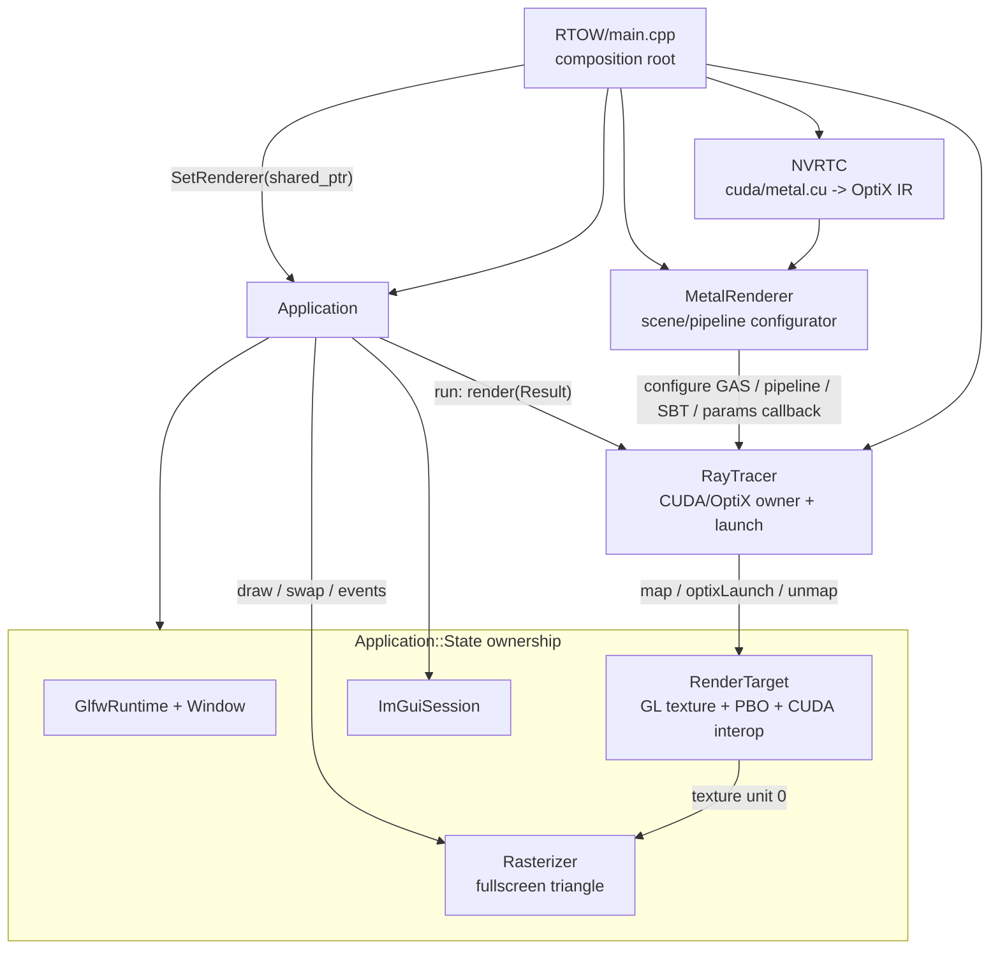
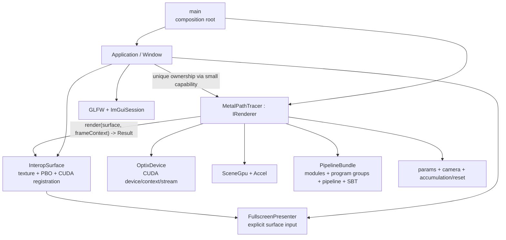

# Venusaur 项目维护指南

> 这是一份面向后续维护者与代码审计者的“事实地图”，不是对当前实现的背书。
> 快照日期：2026-08-14（America/Toronto）；主线：`Reconstruction`；历史审计基线：`667ed24922c3fdd29ff7ee0289f0eb036ecea281`；当前实现以本文件所在提交为准。
> 当前里程碑、验证结果和唯一下一步见 [`PROJECT_STATUS.md`](PROJECT_STATUS.md)；尚未批准实施的设计疑问见 [`PROJECT_QUESTIONS.md`](PROJECT_QUESTIONS.md)。新对话应先读状态文件，再按需查阅本指南与疑问表。

## 1. 一页结论

Venusaur 历史上确实完成过一版 OptiX 的 *Ray Tracing in One Weekend*，但当前 `Reconstruction` 不是那版完整功能的原样延续，而是一次从头分章节重建、随后抽取公共框架的重构线。

当前真正运行的程序是一个硬编码的四球 Metal 示例：它使用运行时 NVRTC 编译、OptiX 9.1 内建 sphere、`optixTraverse + optixInvoke` 迭代反弹，以及 CUDA/OpenGL PBO 互操作。旧 `master` 曾有随机球场景、dielectric、可移动/景深相机与 accumulation；这些能力尚未完整迁回当前架构。

当前设计不是毫无方向，主线很明确：

1. `Application` 管窗口、事件循环、ImGui 与呈现。
2. `RenderTarget` 管 OpenGL texture/PBO 和 CUDA graphics resource。
3. `RayTracer` 抽取公共 CUDA/OptiX 上下文与 launch 流程。
4. `MetalRenderer` 负责 RTOW Metal 场景、pipeline、SBT 和参数。
5. M1 已移除未形成真实可替换性的 Microsoft Proxy；`Application` 暂时直接组合 `RayTracer`。

项目作者在 M1 后确认了三项长期架构意图：

1. composition root 使用 IoC/依赖注入组装能力，Application 不依赖具体 renderer。
2. 可恢复失败统一使用 Result Pattern，而不是在 `expected`、异常、`exit`、assert 之间混用。
3. 业务与编排 class 以 Rule of Zero 为目标；资源释放集中在窄小的 RAII handle/deleter 中。

问题在于重构仍处于中间态：M1 稳定了应用层生命周期与构建基线，M2 为 active GL/CUDA/OptiX handle 建立了 Result + RAII 基线；但 Application 仍把 Result 转成异常，NVRTC 宏仍直接 `exit`。因此当前优先级是先闭合 Application 的显式错误边界，然后再整理 active/legacy 源码；不继续增加材质或抽象层。

## 2. 当前 HEAD 与已丢弃草稿分别想做什么

### 2.1 HEAD `667ed24` 的意图

提交标题是 `Refactor application loop to use run() method and improve GLFW callback handling`。它做了两件连贯的事：

- 把 `main` 中的 `while (app->IsRunning()) app->Update()` 收进 `Application::run()`，让 Application 拥有事件循环。
- 把 GLFW error/key callback 从自由函数变成 `Application` 静态成员，并删除 `IsRunning`、`Update`、`ToggleUi` 这些外露的循环控制 API。

这延续了 2024 年 `d8123c1` “Application 管生命周期”的设计方向。

### 2.2 五个已丢弃草稿文件的意图

审计开始时只有以下五个 tracked、unstaged 修改，无 staged 或 untracked 文件：

- `.clangd`
- `RTOW/main.cpp`
- `core/include/venusaur/application.hpp`
- `core/src/application.cpp`
- `xmake.lua`

它们是一组完整补丁，目标可概括为：

> `Refactor Application creation and GLFW lifetime with expected/RAII`

证据如下：

- public throwing constructor 改成 private constructor + `Application::create()`。
- 返回值改为 `std::expected<Application, Error>`，区分 GLFW init 与 window creation 失败。
- 裸 `GLFWwindow*` 改成带 deleter 的 `unique_ptr`，另用 token 表达 `glfwTerminate()` 生命周期。
- `main` 改为检查 expected，失败时记录 critical 日志。
- C++20 升到 C++23，clangd 改用 `-std:c++latest`，直接动机是 `<expected>`。
- renderer 为空时不再直接解引用。

这五个文件在 2026-08-13 21:48 曾整体进入临时 stash `2616cc9`（消息 `temp`），其 index parent 为 `fcc286a`。M0 清理前的工作树与该 index tree 完全一致；stash 的 untracked snapshot 为空。因此它们不是零散残留，也没有另一批遗失的 untracked 文件。M0 在再次核对后将这五个文件精确恢复到 `667ed24`，不再保留这份有缺陷的实现。

### 2.3 为什么 M0 丢弃了这组补丁

已确认的问题：

1. **本地实际构建失败。** 最初审计 C++23 草稿时，Clang 22.1.3 在 vendored Microsoft Proxy v4 的 `trivially_relocatable_if_eligible` 分支产生语法错误；M0 恢复 `667ed24` 后，默认 `-std:c++20` 构建仍以相同错误失败。因此 blocker 属于当前 Proxy/Clang 组合，不能只归因于草稿的 C++23 升级。用仅限诊断的命令行宏关闭该特性分支后，项目曾完成编译和链接，但该宏不是正式修复。
2. **GLFW callback 保存了悬空的 `this`。** private constructor 先执行 `glfwSetWindowUserPointer(window, this)`，随后 `create()` 将临时 `Application` 移入 `std::expected`。默认 move 不会更新 GLFW 内保存的地址；F1 和 resize callback 之后可能解引用已销毁的临时对象。这是 P0 运行期缺陷。
3. **ImGui 清理被注释。** `ImGui_ImplOpenGL3_Shutdown()`、`ImGui_ImplGlfw_Shutdown()`、`ImGui::DestroyContext()` 不再执行。
4. **GLFW token 自身泄漏。** custom deleter 调用 `glfwTerminate()`，却没有 delete `new GlfwToken()` 得到的 token。
5. **错误模型只完成了一半。** factory 把两个 GLFW 错误放进 expected，但随后 `RenderTarget`、`Rasterizer`、ImGui、CUDA 初始化仍可能 throw/assert/exit。
6. **Application 暗含单实例约束。** 每个实例各自拥有一个 terminate token；多个 Application 并存时，一个实例析构会终止另一个仍在使用的 GLFW runtime。

最小安全方向有两种：

- 保持 C++20，使用完整 RAII + throwing constructor，并只在 `main` 捕获一次；或
- 保持 expected，但返回 `std::expected<std::unique_ptr<Application>, StartupError>`（固定对象地址、禁止 copy/move），同时解决当前 Proxy/Clang 兼容问题。

后续若重做该功能，不要恢复这种“可移动的 Application 把 `this` 注册给 C callback”的组合。

## 3. 当前实际构建边界

`xmake.lua` 当前只构建下列有效路径：

| 层 | 生效文件 | 作用 |
|---|---|---|
| app/core | `application.cpp` | GLFW、ImGui、循环与组合 |
| display | `render_target.cpp`、`rasterizer.cpp` | CUDA/GL PBO、texture、全屏三角形 |
| OptiX common | `ray_tracer.cpp` | CUDA stream、OptiX context/pipeline/GAS/SBT/launch |
| sample host | `RTOW/main.cpp`、`metal_renderer.hpp` | NVRTC、场景、pipeline/SBT 配置、launch params |
| sample device | `RTOW/cuda/metal.cu` 及其 headers | raygen、miss、Lambertian/Metal closest-hit |

`core/src/*.cpp` 会被加入，但 `camera.cpp` 被明确排除；`RTOW` target 只加入 `RTOW/*.cpp`，因此只有 `main.cpp`。

### 3.1 当前是 legacy/dead code 的文件

以下内容不属于当前可用架构：

- `RTOW/renderer_image.h`
- `RTOW/renderer_background.h`
- `RTOW/renderer_sphere.h`
- `RTOW/renderer_normal.h`
- `RTOW/renderer_antialiasing.h`
- `RTOW/renderer_diffuse.h`
- `core/src/RayTracer.cu`
- `core/src/Scene.h`
- `core/src/material.h`
- `core/include/venusaur/camera.hpp` 与被排除的 `core/src/camera.cpp`

这些文件中仍引用已经删除或不存在的 `renderer_base.h`、`output_buffer.h`、`camera.h`、`RayTracer.h`、`vec_math.h`。它们可以作为历史线索，但不能当作现行 API，也不能据此判断当前功能完整度。

后续必须二选一：

- 教程定位：把每一章整理成 `examples/01_image`、`02_background` 等可独立构建的 target；
- 单一 renderer 定位：从现行源码树移除这些文件，让 Git/tag 保存教程历史。

“文件还在、基类已经消失”是当前认知成本最高的状态。

## 4. 当前运行时架构与数据流



每帧路径：

```text
Application::run
  -> RayTracer::render(RenderTarget)
  -> cudaGraphicsMapResources(PBO)
  -> MetalRenderer::setupParams()
  -> launch params H2D copy
  -> optixLaunch()
  -> cudaGraphicsUnmapResources(PBO)
  -> glTextureSubImage2D(PBO -> texture)
  -> Rasterizer full-screen draw
  -> optional ImGui overlay
  -> swap buffers / poll events
```

GPU 端 `__raygen__` 使用 `optixTraverse + optixInvoke` 循环反弹，因此 OptiX pipeline trace depth 保持为 1。payload 只用两个 32-bit word 携带一个本地 payload 指针。不同 sphere 通过 per-primitive SBT index 选择 Lambertian 或 Metal record。

### 4.1 当前对象所有权（实际而非理想）

| 对象 | 当前拥有内容 | 主要问题 |
|---|---|---|
| `Application` | 内部 State 按顺序拥有 GLFW、window、RayTracer、RenderTarget、Rasterizer、ImGui | 已禁止 copy/move并修复应用层 teardown；仍直接依赖具体 RayTracer 且使用 shared ownership |
| `RenderTarget` | RAII texture、PBO、CUDA graphics registration | owner 已闭合；仍依赖 texture unit 0 和固定尺寸 |
| `Rasterizer` | RAII GL program、VAO；shader 为 setup 局部 RAII | owner 已闭合；仍依赖隐式 GL texture state |
| `RayTracer` | RAII CUDA stream、OptiX context/pipeline、GAS/params/SBT buffers | owner 已闭合且 setup 可替换；职责仍过多 |
| `MetalRenderer` | non-owning GAS handle、host params | GPU owner 仍在 RayTracer；callback 已改为 weak ownership，但该 class 仍只是配置器 |

## 5. 设计评估

### 5.1 值得保留的方向

- `Application` 接管主循环，composition root 保持在 `main`。
- CUDA/GL interop 避免完整图像回读到 CPU。
- host/device 共用 launch params/material header，减少 ABI 重复定义。
- NVRTC + OptiX IR 让 shader 不必由 xmake/nvcc 静态编译。
- 使用 OptiX 内建 sphere primitive 和 per-primitive SBT mapping。
- `optixTraverse + optixInvoke` 将多次反弹变成 raygen 内迭代，避免深 continuation stack。
- `core` 与 `RTOW` sample 分目录的总体方向正确。

### 5.2 P0/P1 架构风险

#### M1/M2 已消除的 P0

- 移除 Proxy 后，默认 C++20/Clang 22.1.3 Release build 已恢复，不再依赖 feature-test macro workaround。
- `Application` 现在不可 copy/move，GLFW user pointer 保存的地址在对象生存期内稳定。
- GLFW、window 和 ImGui 已有部分构造安全的 RAII；State 声明顺序保证 ImGui 与 GL 对象先于 window/context 释放。
- 单实例约束不再隐含：第二个同时存活的 `Application` 会明确抛出 `logic_error`。
- M2 用 `UniqueResource` + deleter 覆盖 active GL/CUDA/OptiX handle；高层资源 class 不再声明 destructor/copy/move。
- RenderTarget 析构顺序为 unregister CUDA、删除 PBO、删除 texture；RayTracer 会依次释放 SBT/params/GAS、pipeline、context、stream。
- `MetalRenderer` callback 改为 `weak_ptr`，失效时返回 Error；module/program group 等 setup 临时资源支持部分失败清理。
- mapped PBO 有 scoped guard；map 后 copy/params/launch 任一步失败都会 best-effort unmap。

#### P1：职责与接口不闭合

- `RayTracer` 同时是 device/context、资源仓库、pipeline builder 与 renderer。
- `MetalRenderer` 名为 renderer，却不提供 render；它只是给 RayTracer 安装状态与 callback。
- M1 去掉了无效 type erasure，并用 PIMPL/forward declaration 避免从 `application.hpp` 暴露 CUDA/OptiX header；不过 `SetRenderer` 仍接受具体 `shared_ptr<RayTracer>`，真正的小型 renderer capability 尚未建立。
- SBT buffer 已通过 move-only owner 真正转交给 RayTracer；不过 SBT 与具体 renderer 的职责归属仍需在职责翻转时调整。
- params callback 现在返回 Result，并检查未设置、renderer 失效和 device allocation 容量；`span` 生存期仍是调用方契约。
- RenderTarget 只在构造时把 texture 绑定到 unit 0；Rasterizer 不显式接收/绑定目标，依赖隐式全局 GL 状态。
- resize 只更新窗口宽高，RenderTarget 保持初始分辨率；HiDPI 下还应使用 framebuffer size。必须明确选择固定内部渲染分辨率或 resize/reallocate/reset accumulation。
- OptiX function table definition 已移入唯一的 `ray_tracer.cpp`。

### 5.3 当前渲染功能的已知缺口

- Metal sample 每帧重新计算 100 spp 并覆盖图像；`subframe_index` 只改变 seed，没有 accumulation buffer，因此不会渐进收敛，静态画面会持续重采样。
- outer seed 没有吸收 payload 中反弹后的 seed，后续 sample 会与前一个 sample 的 bounce 随机序列重叠，产生相关性。
- pipeline 声明 11 个 payload word（`sizeof(MetalPayload) / 4`），实际 traverse/invoke 只传两个 pointer word；这会无谓扩大 payload register 预算。
- Metal closest-hit 没有拒绝 `dot(scattered, normal) <= 0` 的方向，与书中的 metal scatter 规则不一致。
- active camera 是 `MetalRenderer::setupParams()` 内硬编码的 pinhole camera；旧 Camera 不在构建中。
- scene 是 `MetalRenderer` 构造函数里的四个硬编码 sphere；没有 dielectric、最终随机场景、景深或 motion blur。
- 读取 `cuda/metal.cu` 时未检查文件是否打开；NVRTC 宏在打印 program log 前直接 `exit`，会丢失最有价值的 shader 编译诊断，也绕过 C++ 析构。

## 6. 构建与平台事实

最后一次审计环境：

- Windows
- xmake `3.0.7+HEAD`
- Visual Studio 2026 toolchain discovery
- Clang `22.1.3` (`clang-cl`)
- CUDA `13.0`（来自 `CUDA_PATH`）
- OptiX SDK `9.1.0`（来自 `OPTIX_INSTALL_DIR`）

正常入口原意是：

```powershell
xmake f -m release
xmake build rtow
xmake project -k compile_commands --lsp=clangd build
xmake run rtow
```

最后一条构建数据库命令用于 clangd；它生成 ignored `build/compile_commands.json`。`.clangd` 只定位该数据库，不再重复硬编码 CUDA/OptiX/MSVC 路径。configure、toolchain 或 include 变更后应重新运行该命令。NVRTC 运行时编译的 `.cu` 不属于当前 host compilation database。

日志约定：日志参数直接交给 `spdlog::*` 格式化，不先生成中间字符串；非日志 API 需要字符串值时使用 C++ `std::format`。因此普通字符串处理不依赖 spdlog bundled fmt，active host 代码也不使用 `std::cout` 或 `std::cerr` 记日志。

格式化约定：仓库 `.clang-format` 是唯一风格来源；当前基线用 VS LLVM clang-format 22.1.3 生成，`Standard: Latest` 用于解析 C++23。每次生成或修改项目自有 C/C++ 代码后，提交前对变更文件执行：

```powershell
clang-format -i --style=file --fallback-style=none <changed-project-files>
clang-format --dry-run --Werror --style=file --fallback-style=none <changed-project-files>
```

`third_party` 和已标记的 legacy 教程文件不参与自动格式化；不要用全仓库 glob 重写 vendored 代码。

M0 恢复到 `667ed24` 后，正常 C++20 build 曾因 Proxy/Clang 组合失败。M1 删除未产生实际解耦价值的 Proxy 依赖后恢复构建；M2 将 host C++ 升到 C++23 以使用 `std::expected`（当前 clang-cl 实际采用 `-std:c++latest`），NVRTC device source 仍使用 C++20。默认 Release 已在同一工具链上完成全量编译和链接，审计宏 workaround 从未进入正式配置。

其他构建问题：

- Git 规范目录名是 `RTOW`，`xmake.lua` 使用 `rtow`。Windows 不敏感，Linux checkout 会找不到路径。
- 虽然脚本声明 Linux clang，CUDA library path 仍写成 Windows 风格 `lib/x64`，项目当前实际是 Windows-only。
- compilation database 是 ignored 生成物；新 checkout 或构建配置变更后，clangd 在重新生成它之前会缺少准确的编译命令。
- CUDA/OptiX 环境缺失时没有在 configure 阶段一致地 fail-fast，最终错误会出现在无条件 include 的 public headers。
- 709 个 tracked 文件中 665 个位于 `third_party`；分析架构时应默认排除 vendored 代码。
- 当前没有 CI、自动测试、tag 或有效 README；根 README 只有 `Venusaur`。

## 7. 历史与分支地图

### 7.1 主线演化

| 时间/提交 | 意义 |
|---|---|
| 2022 `bf4eea8` | 首次完成 RTOW；之后 `19c2713` merge RTOW 分支 |
| 2024 `d8d6111` | OptiX 8 / CUDA 12 / vcpkg |
| 2024 `d8123c1` | 引入 Application 与 IDrawable，让应用管理生命周期 |
| 2024 `635c889` | 修复 renderer 必须先于 GLFW/GL 析构的问题 |
| 2025 `932c88b` | 新建独立 RTOW project，开始再次逐章重建 |
| 2025 `e76db5e` | 最大断点：VS -> xmake，全面重排 Core/RTOW 与 renderer/output 架构 |
| 2025 `b9841db` | `optixTrace` -> `optixTraverse + optixInvoke` |
| 2025 `c93fcba` | nvcc -> 运行时 NVRTC |
| 2025 `fc05063` | CUDA shader 移入 `RTOW/cuda` |
| 2025 `5df1a62` | 升级 OptiX 9.1 |
| 2025 `8e10757` | Application 集成 Rasterizer |
| 2025 `f81546a` | 删除 renderer_base，拆出 RayTracer 与 RenderTarget |
| 2025 `8d8cfc4` | 引入 Microsoft Proxy，尝试 IoC/type erasure |
| 2025 `667ed24` | Application 接管 run loop 与 GLFW callbacks |
| 2026 M1 `40cc3ea` | 移除无效 Proxy；稳定 Application 地址、部分构造与 teardown；恢复默认构建 |
| 2026 M2 `e668f3f` | C++23 Result；active GL/CUDA/OptiX RAII；mapped PBO guard；weak renderer callback |
| 2026 M2.1 `6c96d42` | 日志入口统一到 spdlog；clangd 接入 xmake compilation database |
| 2026 M2.2 `9f3a44c` | 修正格式化边界：非日志字符串使用 `std::format`，不依赖 spdlog |
| 2026 M2.3 `b0f5d89` | active 源码 clang-format 基线；格式化验收协议；今日总结与架构图 |
| 2026 M2.4 `ef863db` | 记录平坦编排、资源封装、致命失败清理与 Result 上传决策 |
| 2026 M2.5（本指南所在提交） | 建立与已批准路线分离的设计疑问表；不改代码 |

`e76db5e` 一次修改了 49 个非 third-party 源/构建文件（约 `2701+ / 6525-`），提交正文却只有 “Uses xmake”。这类没有迁移说明的大提交，而非复杂 merge 图，是今天难以还原设计意图的主要原因。

### 7.2 分支定位

| ref | tip | 与 Reconstruction 的关系 | 结论 |
|---|---|---|---|
| `Reconstruction` | `667ed24` | 当前事实主线 | canonical；应成为默认维护入口 |
| `master` | `faea0cf` | merge-base `6726adc`；主线独有 46、master 独有 3 | legacy VS/config/docs；不要整体 merge |
| `origin/RTNW` | `eba7381` | 从 `19c2713` 分出 2 commits | motion-blur 算法参考，按新架构重写 |
| `origin/GLRenderer` | `e3202fb` | 2022 的 4-commit 原型 | PBO 已被替代；glTF/Cornell Box 仅保留需求/资产想法 |
| `origin/output_nvjpeg` | `fdfed1b` | 早期 4-commit 实验 | headless/JPEG 输出需求参考，不可直接复用 |

当前本地没有 tags，`origin/HEAD` 仍指向停滞的 `master`。本表基于本地 remote-tracking refs，审计时没有 fetch。

#### 各历史分支真正值得保留的内容

- **master**：README 中的项目描述、参考链接与演示链接；版本和 VS 构建步骤已过时。
- **RTNW**：`5998d6f` 的 GAS/IAS motion transform + 随机 ray time，以及 `eba7381` 对 bounce ray time 的传播修复。
- **GLRenderer**：引入场景导入层的需求和 Cornell Box 资产；旧 loader 是未完成试验，不要 cherry-pick。
- **output_nvjpeg**：让 encoder 直接消费 device-side interleaved RGB、避免 H/D copy 的思路。

旧本地 `diffuse` 分支的四个 orphan commits 与后来主线提交 tree 完全相同，没有遗失实现。现存 stash `optix9` 只修改旧 VS CUDA/OptiX 配置，也已被 xmake + OptiX 9.1 主线替代。

## 8. 推荐目标架构

不要把项目扩成通用引擎；对这个规模，一个小而明确的 OptiX runtime + RTOW renderer 足够。



边界原则：

1. Application 只知道一个小型 renderer capability，例如 `render(InteropSurface&, FrameContext)`；不要 include `ray_tracer.hpp`。
2. OptixDevice 只拥有设备级资源，不拥有某个场景的 GAS/SBT/params。
3. 具体 renderer 拥有其 pipeline、scene、SBT、params 与 accumulation；它才是真正的 renderable。
4. 原生句柄 wrapper 全部 move-only、允许部分构造失败、析构 `noexcept`。
5. 除确实共享的 device/context 外，优先值语义或 `unique_ptr`，不要用 shared_ptr 掩盖所有权。
6. host/device ABI 放在独立、可自包含 header，并为 size/alignment 添加 `static_assert`。
7. NVRTC compilation 独立成组件，错误中必须包含 source path、options 与完整 compile log。

### 8.1 已确认的设计约束

#### IoC 与 Proxy

IoC 是目标，Microsoft Proxy 只是可能的实现工具，不应与目标本身绑定。M1 前的代码并未真正完成依赖反转：`Application::SetRenderer` 只接受 `shared_ptr<RayTracer>`，随后才把这个已经确定的具体类型装进 `pro::proxy<Renderable>`；没有第二种实现、test double、factory 或由 composition root 注入的抽象 capability。因此那一层只提供了调用转发，没有改变依赖方向。

M1 移除 Proxy 是收回未完成的机制，并非否定 IoC。以后可以重新采用 Microsoft Proxy，但应满足以下条件：

- `Application` 的公开边界接受小型 renderer capability，而不是具体 `RayTracer`。
- `main` 是 composition root，负责选择实现并明确所有权/生命周期。
- 至少能用第二个 renderer 或 test double 证明替换不需要修改 Application。
- type erasure 的收益足以覆盖第三方依赖、编译器兼容与调试成本；否则小型 interface、函数对象或模板注入也可以实现依赖反转。

#### Result Pattern

M2 已确定 host C++23，并以 `std::expected<T, Error>` 定义项目 `Result<T>`；Error 保存 domain、底层 code、operation 和 message。新迁移的 active GL/CUDA/OptiX create/setup/render API 使用 Result，析构只做 best-effort cleanup 与诊断，不 throw/terminate。

Application 当前仍将底层 Result 桥接成异常，NVRTC 宏仍会 `exit`。这不是因为 C++ 天生更适合 throw，而是 M1 为了先修复生命周期、同时不改动当时的 public constructor 和 `void run()` 而留下的过渡桥接。C++ 构造函数不能返回 Result，throw 因此是传统的构造失败手段；但它隐藏控制流，而当前转换还将结构化 Error 压成了字符串。对本项目已确认的风格，fallible factory + `Result<void> run()` + 显式 early return 更合适。

Result 只解决“错误怎么上传”，不要把它与“失败后必须回滚所有资源”绑定。对 GLFW/ImGui 这类进程级服务，若启动失败后唯一策略是记录错误并结束进程，不需为 sanitizer 式的“退出前完美清理”增加部分初始化状态机。

#### 平坦编排与有意义的封装

项目不把文件或函数的纵向长度当作问题；更需要控制的是嵌套深度、隐藏控制流和跨层生命周期推理。一段长但对称、顺序清晰的 GLFW/ImGui create/init/shutdown 流程，比被拆进 manager、factory、service 和继承层次更容易维护。不要只为减少调用者看到的行数而提取 class/function。

封装的准入条件是它至少闭合一项真实责任：唯一资源所有权、析构顺序、合法状态或稳定领域不变量。`UniqueResource`、`RenderTarget` 等叶子 owner 符合这个条件，因为它们消除了上层的析构与错误路径；仅转发一串显式调用的 wrapper 不符合。业务层优先组合与 capability injection，不建立继承树。

GLFW/ImGui 的正常关闭仍应保持显式的逆序 shutdown；但致命启动失败可直接上传到 `main` 并结束进程，不为尚未完整初始化的 backend 增加复杂 rollback。这项策略只适用于当前“启动失败即退出”的 executable；如果未来需要重试、多 Application 或 library embedding，再重新评估部分初始化清理。

#### Rule of Zero

Application、renderer、scene 等业务/编排 class 不应手写资源释放逻辑，也不应靠成片的 deleted/defaulted special members 修补所有权。它们应组合 move-safe 的 RAII value/handle，让编译器自然生成正确的 copy/move/destructor；确实不可复制的底层资源由其窄小 handle 类型表达。

M2 新增一个通用 move-only `UniqueResource` 叶子基础设施；RenderTarget、Rasterizer、RayTracer、MetalRenderer 不再手写 destructor/copy/move。M1 的 `Application` 显式删除 copy/move，仍是修复 GLFW callback 悬空的安全过渡，不是最终 Rule of Zero 形态。下一次调整 Application 时，应考虑让 GLFW user pointer 指向地址稳定的内部 State，而不是外层 `Application`；这样 State 可由 `unique_ptr` 保持地址稳定，外层对象的移动语义便不再破坏 callback。若使用 incomplete PIMPL 而必须在 `.cpp` 中写 `= default` destructor，应把它视为编译边界的机械例外，不在其中编写清理流程。

## 9. 推荐重构顺序

1. **已完成（M1）：恢复可构建基线。** 移除 Proxy，不采用诊断 workaround。
2. **已完成（M1）：修 Application 地址与 teardown。** 禁止 copy/move，恢复 ImGui shutdown，以 RAII 明确 GLFW 单实例和逆序析构。
3. **已完成（M2）：补齐 active 底层 RAII。** CUDA stream/buffer、OptiX module/program/pipeline/context、GL texture/buffer、mapped PBO guard；以 C++23 Result 报告可恢复失败。
4. **下一步（M3）：贯通 Application Result 与线性生命周期。** fallible create/run/NVRTC 显式向 `main` 上传 Error；正常 GLFW/ImGui shutdown 对称可见；致命启动失败不设计复杂 rollback。
5. **M4：声明 active/legacy 边界。** 修正 `RTOW` 大小写，把失效章节移出主源码树或改成可构建 examples。
6. **翻转 RayTracer/MetalRenderer 关系。** 让 `MetalPathTracer` 真正实现 render 并拥有场景资源；去掉捕获裸 `this` 的 setup callback。
7. **显式化 surface/presenter。** Presenter 每帧接收并绑定 texture；定义 resize 与 HiDPI 规则。
8. **恢复 RTOW 数据模型。** 抽出 Camera、Scene、材质/SBT mapping 和 ABI checks。
9. **加入 accumulation。** 定义 camera/scene/resize 变化时的 reset 规则，再修随机序列与 payload budget。
10. **最后恢复功能。** dielectric、最终随机场景、景深；motion blur 参考 RTNW，但按 OptiX 9.1 架构重写。

最低测试集：

- host C++ build smoke test；
- 所有 active `.cu` 的 NVRTC compile smoke test，并保留 compile log；
- host/device param size/alignment static assertions；
- 16x16 或 32x32 固定 seed 图像回归；
- Application/renderer 创建失败与 teardown 测试；
- resize/accumulation reset 测试。

## 10. 后续审计清单

每次大重构后更新本文件顶部快照与 `PROJECT_STATUS.md`，并至少检查：

```powershell
git status --short --branch
git log --graph --decorate --oneline --all -n 60
git diff --check
xmake f -m release
xmake build rtow
```

然后回答：

- `xmake.lua` 实际构建哪些文件？
- 是否还有 active 文件引用已删除 API？
- 每个 CUDA/OptiX/GL handle 的唯一 owner 是谁？
- 析构是否绝不抛异常？
- callback/span/raw pointer 的 owner 是否活得足够久？
- host/device ABI 是否由测试或 static_assert 约束？
- resize、camera、scene 变化是否正确 reset accumulation？
- README、默认分支和本指南是否仍指向事实主线？

建议为以后不可逆的架构选择写短 ADR，并建立里程碑 tag，例如：`legacy-rtow` (`bf4eea8`)、`optix8` (`d8d6111`)、`xmake-rewrite` (`e76db5e`)、`optix9.1` (`5df1a62`) 和 `ioc-baseline` (`667ed24`)。这些 tag 当前尚不存在。
